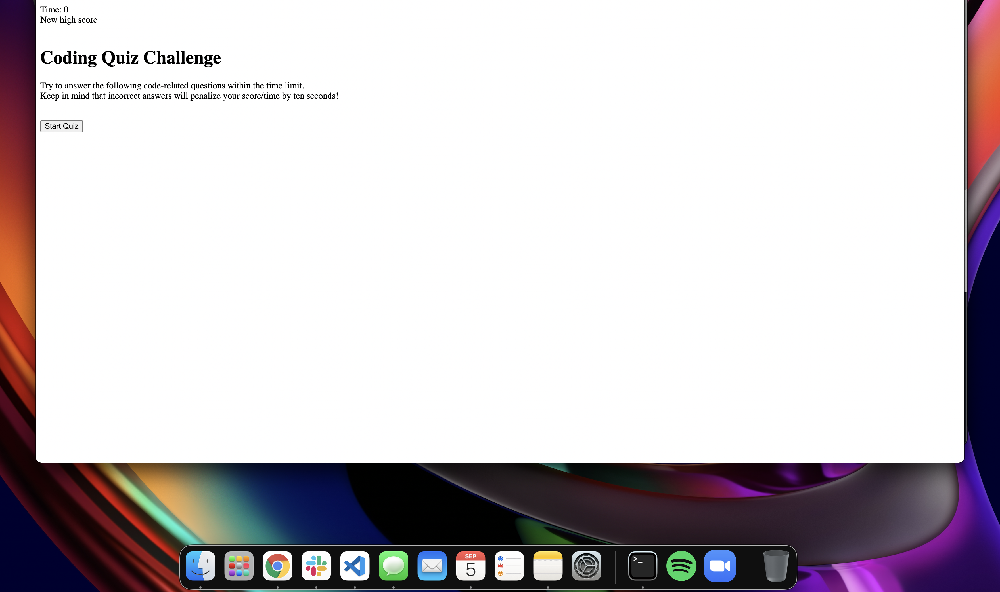

# Coding Quiz - Challenge 4
A timed multiple choice coding quiz. Wrong answers should deduct from the over all time. Once the quiz is over a high score with initials to be logged. 
<!-- TABLE OF CONTENTS -->
## Table of Contents

* [About the Project](#about-the-project)
* [Built With](#built-with)
* [Installation](#installation)
* [Contact](#contact)

### About the Project

### Built With

* HTML
* CSS
* JavaScript

### Installation
Clone the repo
git clone https://github.com/urbanearthymama/challenge-4

### Contact

Patricia Nelson urbanearthymama@gmail.com

Project Link: https://github.io/urbanearthymama/challenge-4